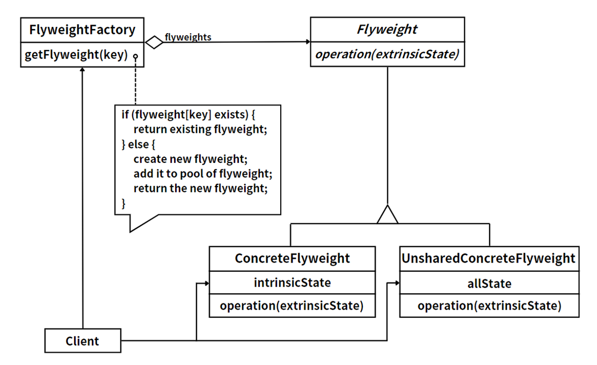

# Flyweight Pattern

::: tip Definition
Use **sharing** to efficiently support large numbers of fine-grained objects. By separating intrinsic state (shareable) from extrinsic state (context-dependent), the Flyweight pattern dramatically reduces the number of objects in memory.
:::

## 1. Intent

**What problem does it solve?**
*   The system needs to create a huge number of similar objects that differ only in a few attributes, causing excessive memory usage.
*   Example: An online map with hundreds of thousands of POI icons — most share the same icon image but have different coordinates.

**Example scenarios**
*   ✅ Scenario A: **Online map application** — hundreds of thousands of POI markers (restaurants, gas stations, parking lots). Icon style is shared intrinsic state; GPS coordinates are extrinsic state.
*   ✅ Scenario B: **Game particle systems** — thousands of bullets/particles share texture and model data; position and velocity are unique per instance.
*   ❌ Anti-pattern: If the object count is small or each object's state is highly unique, the complexity cost isn't worth it.

## 2. Structure

### UML Class Diagram

> 

### Roles & Responsibilities
| Role | Name | Responsibility |
| :--- | :--- | :--- |
| **Flyweight** | Flyweight Interface | Declares operations that accept extrinsic state. |
| **ConcreteFlyweight** | Concrete Flyweight | Stores intrinsic state (shareable); implements the Flyweight interface. |
| **UnsharedConcreteFlyweight** | Unshared Flyweight | Objects that aren't shared; hold all state internally. |
| **FlyweightFactory** | Flyweight Factory | Manages the flyweight pool; returns existing instances or creates new ones. |

### Intrinsic vs Extrinsic State
*   **Intrinsic State**: Stored inside the flyweight, immutable, environment-independent, shareable. E.g., icon image / color.
*   **Extrinsic State**: Passed in by the client, varies with context, not shareable. E.g., GPS coordinates on a map.

### Collaboration Flow
1. Client requests a flyweight from the Factory (passing an intrinsic state key).
2. Factory checks the pool — returns existing instance if found, otherwise creates and caches a new one.
3. Client passes extrinsic state when invoking the flyweight's operation.

## 3. Code Example

> **Scenario**: **Online map POI icon rendering** — the map has many markers (restaurants, gas stations), icon styles are shared, coordinates vary.

::: code-group

```cs [C#]
// Flyweight interface
public interface IPoiIcon
{
    void Render(double lat, double lng);
}

// ConcreteFlyweight — shared icon (intrinsic: type + image)
public class PoiIcon : IPoiIcon
{
    public string Type { get; }
    public string ImagePath { get; }

    public PoiIcon(string type, string imagePath)
    {
        Type = type;
        ImagePath = imagePath;
        Console.WriteLine($"  [Created icon] {type} -> {imagePath}");
    }

    public void Render(double lat, double lng)
        => Console.WriteLine($"  📍 [{Type}] ({lat}, {lng}) using {ImagePath}");
}

// FlyweightFactory
public class PoiIconFactory
{
    private readonly Dictionary<string, IPoiIcon> _pool = new();

    public IPoiIcon GetIcon(string type)
    {
        if (!_pool.TryGetValue(type, out var icon))
        {
            icon = new PoiIcon(type, $"/icons/{type}.png");
            _pool[type] = icon;
        }
        return icon;
    }

    public int PoolSize => _pool.Count;
}
```

```java [Java]
// Flyweight interface
public interface PoiIcon {
    void render(double lat, double lng);
}

// ConcreteFlyweight
public class ConcretePoiIcon implements PoiIcon {
    private final String type;
    private final String imagePath;

    public ConcretePoiIcon(String type, String imagePath) {
        this.type = type;
        this.imagePath = imagePath;
        System.out.printf("  [Created icon] %s -> %s%n", type, imagePath);
    }

    @Override
    public void render(double lat, double lng) {
        System.out.printf("  📍 [%s] (%.4f, %.4f) using %s%n", type, lat, lng, imagePath);
    }
}

// FlyweightFactory
public class PoiIconFactory {
    private final Map<String, PoiIcon> pool = new HashMap<>();

    public PoiIcon getIcon(String type) {
        return pool.computeIfAbsent(type,
            t -> new ConcretePoiIcon(t, "/icons/" + t + ".png"));
    }

    public int getPoolSize() { return pool.size(); }
}
```

:::

Client usage:

::: code-group

```cs [C#]
var factory = new PoiIconFactory();

var poiData = new (string type, double lat, double lng)[]
{
    ("restaurant",  40.7128, -74.0060),
    ("gas_station", 40.7580, -73.9855),
    ("restaurant",  34.0522, -118.2437),
    ("parking",     34.0622, -118.2537),
    ("restaurant",  51.5074, -0.1278),
    ("gas_station", 51.5174, -0.1378),
};

foreach (var (type, lat, lng) in poiData)
{
    IPoiIcon icon = factory.GetIcon(type);
    icon.Render(lat, lng);
}

Console.WriteLine($"\nTotal POIs: {poiData.Length}, Icon objects: {factory.PoolSize}");
// Total POIs: 6, Icon objects: 3
```

```java [Java]
PoiIconFactory factory = new PoiIconFactory();

String[][] poiData = {
    {"restaurant",  "40.7128", "-74.0060"},
    {"gas_station", "40.7580", "-73.9855"},
    {"restaurant",  "34.0522", "-118.2437"},
    {"parking",     "34.0622", "-118.2537"},
    {"restaurant",  "51.5074", "-0.1278"},
    {"gas_station", "51.5174", "-0.1378"},
};

for (String[] poi : poiData) {
    PoiIcon icon = factory.getIcon(poi[0]);
    icon.render(Double.parseDouble(poi[1]), Double.parseDouble(poi[2]));
}

System.out.printf("%nTotal POIs: %d, Icon objects: %d%n", poiData.length, factory.getPoolSize());
```

:::

## 4. Pros & Cons

### Pros
1. **Dramatically reduces memory**: Thousands of objects may only need a handful of flyweight instances.
2. **Centralized shared-state management**: Intrinsic state is maintained by the factory, avoiding duplication.

### Cons
1. **Increased code complexity**: Splitting state into intrinsic and extrinsic adds design overhead.
2. **Thread safety**: Concurrent access to the flyweight pool requires synchronization.
3. **Extrinsic state management burden**: Clients must track and pass extrinsic state themselves.

## 5. Related Patterns

| Pattern | Similarity | Key Difference |
| :--- | :--- | :--- |
| **Singleton** | Both control instance count | Singleton ensures one global instance; Flyweight manages multiple shared instances keyed by intrinsic state. |
| **Object Pool** | Both reuse objects | Pool objects are mutable and exclusively borrowed; Flyweight objects are immutable and concurrently shared. |
| **Composite** | Often combined | Composite leaf nodes can be implemented as flyweights to reduce memory for large trees. |

## 6. Summary

**Core Idea**

*   The Flyweight pattern is about **sharing the immutable, isolating the variable** — extract shared intrinsic state into reusable flyweight objects, and let extrinsic state be managed externally. This enables extreme memory optimization for scenarios with massive similar objects.

**Real-World Applications**

*   **Java String Pool**: The JVM interns identical string literals — `"hello" == "hello"` is `true`.
*   **Integer Cache**: `Integer.valueOf()` returns cached instances for -128 to 127.
*   **Game Engines (Unity / Unreal)**: Textures, materials, and mesh data are shared across many GameObjects to avoid redundant loading.
*   **Browser DOM**: CSS style objects are shared across multiple DOM nodes rather than duplicated per element.
