# Overview

## What Are Design Patterns?

As developers gain experience, they naturally develop **common code structures and problem-solving approaches** — these are known as **patterns**, reusable solutions to recurring problems.

In 1995, **Erich Gamma, Richard Helm, Ralph Johnson, and John Vlissides** — collectively known as the **Gang of Four (GoF)** — compiled these practices into the seminal book *"Design Patterns: Elements of Reusable Object-Oriented Software"*, which documents **23 classic design patterns**.

> *"A pattern is a **solution** to a problem in a **context**."*

**Design patterns are proven, catalogued solutions to common software design problems.** They promote code reuse, improve readability, and ensure reliability. They are not finished code, but templates for solving problems in specific contexts.

## Classification

Design patterns are categorized by **purpose** into three groups:

- **Creational Patterns**: Focus on object creation mechanisms, separating creation from use.
- **Structural Patterns**: Deal with how classes and objects are composed to form larger structures.
- **Behavioral Patterns**: Focus on communication and responsibility distribution between objects.

### Creational Patterns

Creational patterns focus on **object creation mechanisms**, separating object creation from usage to reduce coupling.

> Decoupling means reducing dependencies between components. If modifying one module forces changes in many others, coupling is too high. Creational patterns provide structured ways to manage object instantiation.

| Pattern | Description | Diagram |
|---------|-------------|---------|
| [Factory Method](/creational/factory-method) | Define an interface for creating objects; let subclasses decide which class to instantiate. |  |
| [Abstract Factory](/creational/abstract-factory) | Provide an interface for creating families of related objects without specifying concrete classes. | 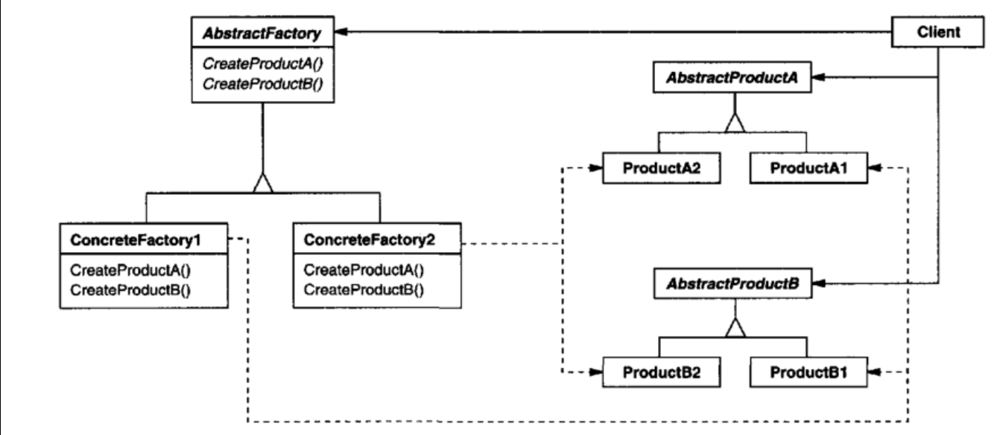 |
| [Singleton](/creational/singleton) | Ensure a class has only one instance with a global access point. | 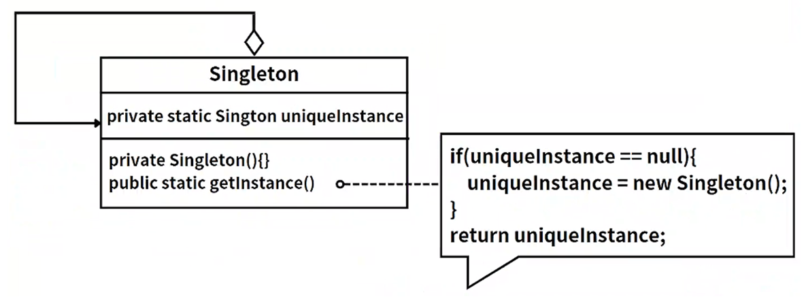 |
| [Prototype](/creational/prototype) | Create new objects by cloning an existing instance. | 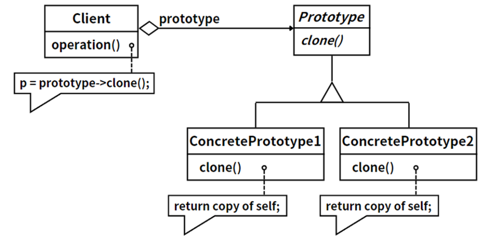 |
| [Builder](/creational/builder) | Separate the construction of a complex object from its representation. |  |

### Structural Patterns

Structural patterns deal with **how classes and objects are composed to form larger structures**, improving modularity and flexibility through inheritance and association.

| Pattern | Description | Diagram |
|---------|-------------|---------|
| [Facade](/structural/facade) | Provide a unified interface to a set of interfaces in a subsystem. | 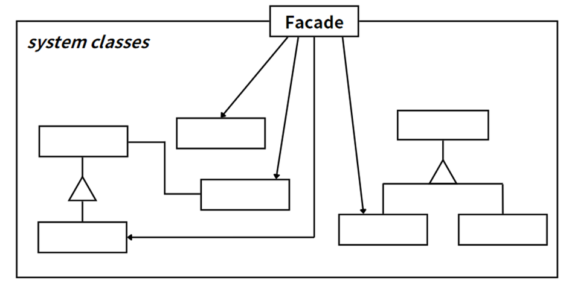 |
| [Adapter](/structural/adapter) | Convert one interface into another that clients expect. |  |
| [Composite](/structural/composite) | Compose objects into tree structures to represent part-whole hierarchies. | 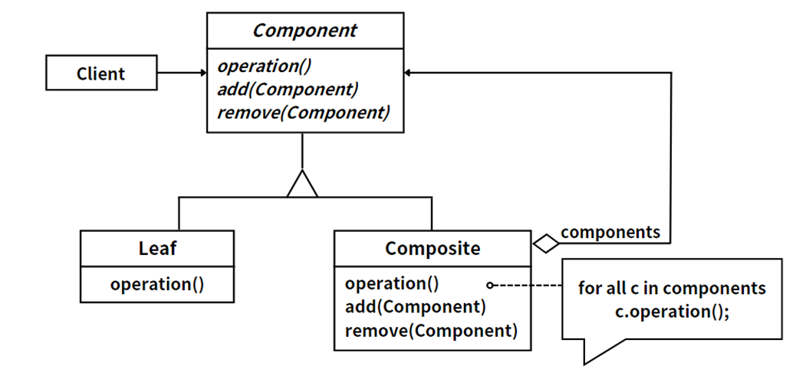 |
| [Proxy](/structural/proxy) | Provide a surrogate to control access to another object. |  |
| [Bridge](/structural/bridge) | Decouple an abstraction from its implementation so both can vary independently. |  |
| [Decorator](/structural/decorator) | Dynamically attach additional responsibilities to an object. | 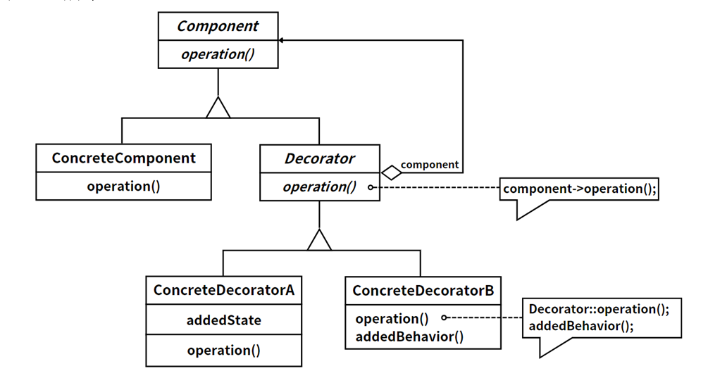 |
| [Flyweight](/structural/flyweight) | Use sharing to efficiently support large numbers of fine-grained objects. |  |

### Behavioral Patterns

Behavioral patterns focus on **communication and responsibility distribution between objects**, abstracting common interaction patterns for efficient collaboration.

| Pattern | Description | Diagram |
|---------|-------------|---------|
| [Strategy](/behavioral/strategy) | Define a family of algorithms, encapsulate each one, and make them interchangeable. | 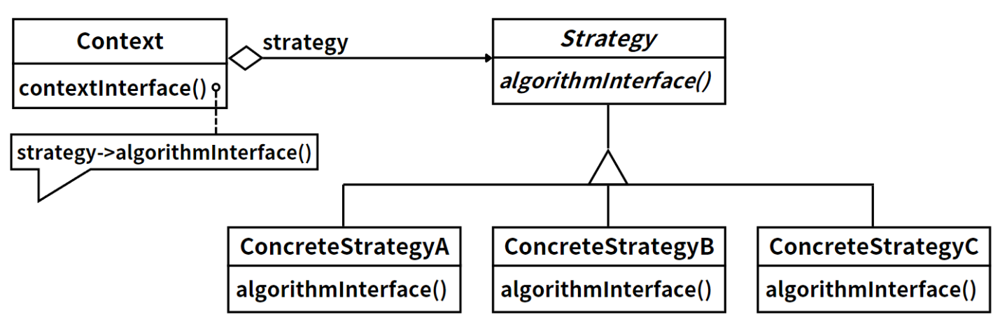 |
| [Template Method](/behavioral/template-method) | Define the skeleton of an algorithm, deferring some steps to subclasses. | 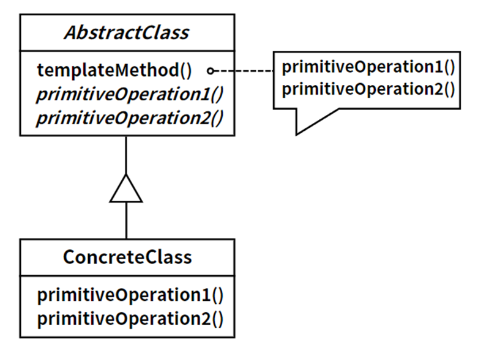 |
| [Mediator](/behavioral/mediator) | Encapsulate object interactions via a mediator to promote loose coupling. |  |
| [Observer](/behavioral/observer) | Define a one-to-many dependency so that when one object changes state, all dependents are notified. |  |
| [Iterator](/behavioral/iterator) | Provide a way to access elements of an aggregate without exposing its internal representation. | 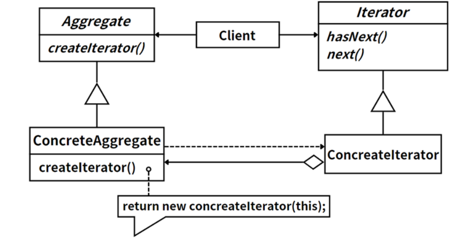 |
| [Memento](/behavioral/memento) | Capture and externalize an object's internal state so it can be restored later. | 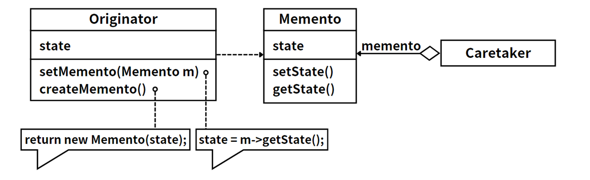 |
| [State](/behavioral/state) | Allow an object to alter its behavior when its internal state changes. |  |
| [Command](/behavioral/command) | Encapsulate a request as an object, enabling parameterization, queuing, and undo. |  |
| [Chain of Responsibility](/behavioral/chain-of-responsibility) | Pass a request along a chain of handlers until one handles it. | 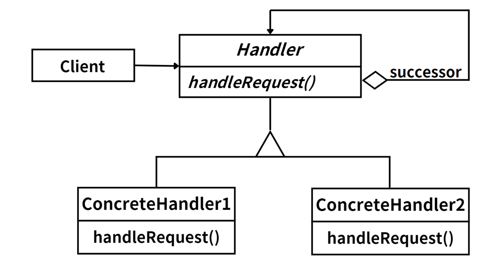 |
| [Visitor](/behavioral/visitor) | Define new operations on elements without changing their classes. |  |
| [Interpreter](/behavioral/interpreter) | Define a grammar representation and an interpreter that processes sentences in the language. |  |

## Scope: Class vs. Object Patterns

Patterns can also be classified by **scope**:

### Class Patterns

Class patterns focus on **static relationships** between classes and subclasses, using inheritance and static methods to share behavior. Relationships are determined at **compile time**.

- **Pros**: Clear structure, easy to understand; enables code reuse via inheritance.
- **Cons**: Deep inheritance hierarchies can become complex; inheritance is static and inflexible.

### Object Patterns

Object patterns focus on **dynamic relationships** between objects, using interfaces, composition, and delegation. Relationships are determined at **runtime**.

- **Pros**: Greater flexibility and extensibility; reduced coupling between objects.
- **Cons**: May increase complexity with more object relationships; dynamic composition can impact performance.

## Why Learn Design Patterns?

- **Code reuse**: Proven solutions reduce redundant work and improve development efficiency.
- **Maintainability**: Well-structured code is easier to understand, modify, and extend.
- **Communication**: Patterns provide a shared vocabulary for developers to discuss design decisions.
- **Flexibility**: Pattern-based designs adapt more easily to changing requirements.
- **Deeper understanding**: Studying patterns deepens your grasp of object-oriented principles.

> Design patterns help developers see code from a new perspective — building software that is easier to reuse, extend, and maintain.
