# 概述 (Overview)

## 什么是设计模式？

随着开发者经验的增长，自然而然会形成一些**通用的代码结构和解决问题的方法** —— 这些被称为**模式**，即针对反复出现的问题的可重用解决方案。

1995 年，**Erich Gamma, Richard Helm, Ralph Johnson 和 John Vlissides**（统称为 **GoF，四人帮**）将这些实践汇编成了具有里程碑意义的著作《设计模式：可复用面向对象软件的基础》，书中记录了 **23 种经典设计模式**。

> *“模式是**在特定上下文中**解决问题的**方案**。”*

**设计模式是针对常见软件设计问题的经过验证、编目分类的解决方案。** 它们提高了代码的可重用性、可读性和可靠性。它们不是现成的代码，而是在特定语境下解决问题的模板。

## 分类

设计模式按**目的**分为三类：

-   **创建型模式 (Creational Patterns)**：关注对象创建机制，将创建与使用分离。
-   **结构型模式 (Structural Patterns)**：处理类和对象如何组合以形成更大的结构。
-   **行为型模式 (Behavioral Patterns)**：关注对象之间的通信和职责分配。

### 创建型模式

创建型模式关注**对象创建机制**，将对象的创建与使用分离，以平衡耦合。

> 解耦意味着减少组件之间的依赖。如果修改一个模块强制要求更改许多其他模块，则耦合度过高。创建型模式提供了管理对象实例化的结构化方法。

| 模式 | 描述 | 图示 |
|------|------|------|
| [工厂方法 (Factory Method)](./creational/factory-method) | 定义一个用于创建对象的接口，让子类决定实例化哪一个类。 | 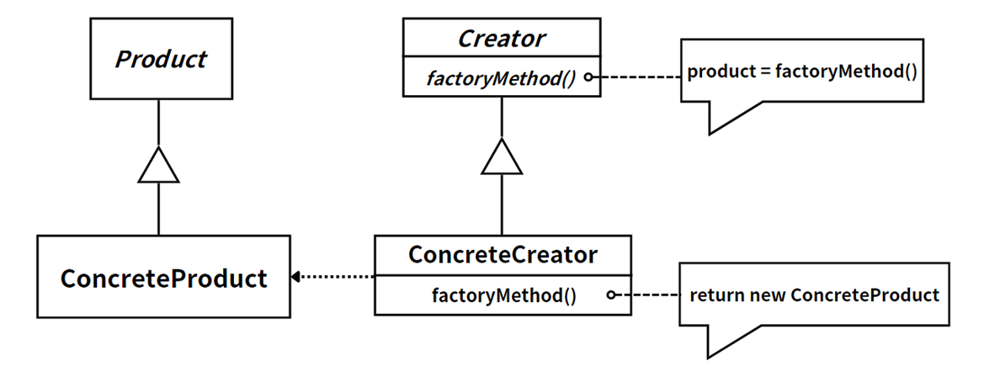 |
| [抽象工厂 (Abstract Factory)](./creational/abstract-factory) | 提供一个创建一系列相关或相互依赖对象的接口，而无需指定它们具体的类。 |  |
| [单例 (Singleton)](./creational/singleton) | 保证一个类只有一个实例，并提供一个访问它的全局访问点。 |  |
| [原型 (Prototype)](./creational/prototype) | 通过克隆现有的实例来创建新对象。 |  |
| [生成器 (Builder)](./creational/builder) | 将一个复杂对象的构建与其表示分离，使得同样的构建过程可以创建不同的表示。 | 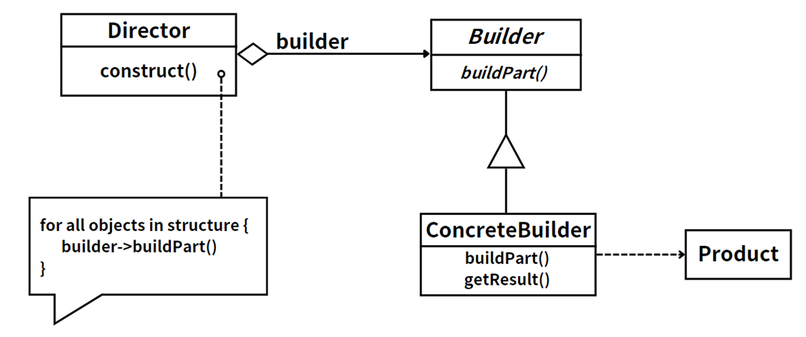 |

### 结构型模式

结构型模式处理**类和对象如何组合以形成更大的结构**，通过继承和关联提高模块化和灵活性。

| 模式 | 描述 | 图示 |
|------|------|------|
| [外观 (Facade)](./structural/facade) | 为子系统中的一组接口提供一个一致的界面。 |  |
| [适配器 (Adapter)](./structural/adapter) | 将一个类的接口转换成客户希望的另外一个接口。 | 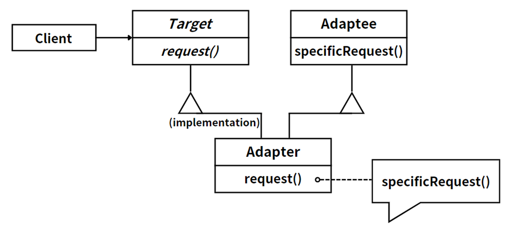 |
| [组合 (Composite)](./structural/composite) | 将对象组合成树形结构以表示“部分-整体”的层次结构。 |  |
| [代理 (Proxy)](./structural/proxy) | 为其他对象提供一种代理以控制对这个对象的访问。 | 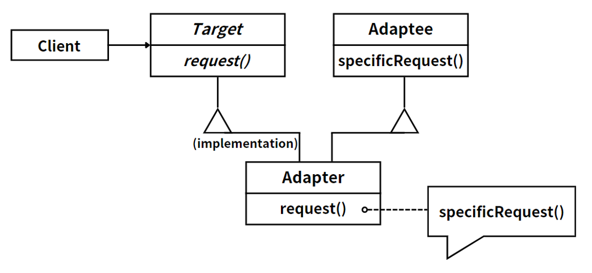 |
| [桥接 (Bridge)](./structural/bridge) | 将抽象部分与它的实现部分分离，使它们都可以独立地变化。 | 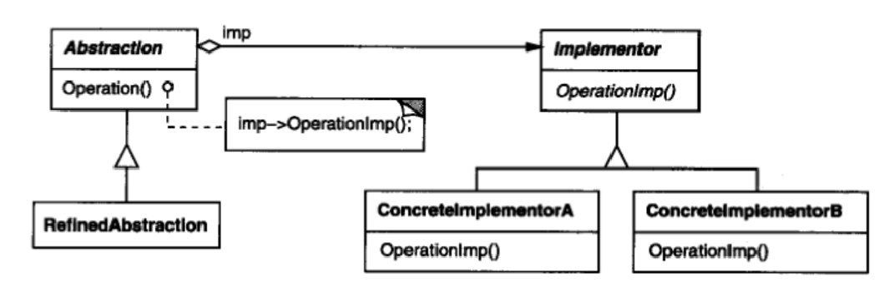 |
| [装饰器 (Decorator)](./structural/decorator) | 动态地给一个对象添加一些额外的职责。 |  |
| [享元 (Flyweight)](./structural/flyweight) | 运用共享技术有效地支持大量细粒度的对象。 |  |

### 行为型模式

行为型模式关注**对象之间的通信和职责分配**，抽象公共交互模式以实现高效协作。

| 模式 | 描述 | 图示 |
|------|------|------|
| [策略 (Strategy)](./behavioral/strategy) | 定义一系列的算法，把它们一个个封装起来，并且使它们可以相互替换。 |  |
| [模板方法 (Template Method)](./behavioral/template-method) | 定义一个操作中的算法的骨架，而将一些步骤延迟到子类中。 |  |
| [中介者 (Mediator)](./behavioral/mediator) | 用一个中介对象来封装一系列的对象交互。 | 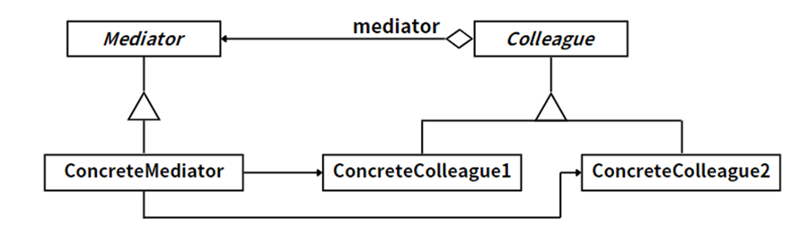 |
| [观察者 (Observer)](./behavioral/observer) | 定义对象间的一种一对多的依赖关系，当一个对象的状态发生改变时，所有依赖于它的对象都得到通知并被自动更新。 | 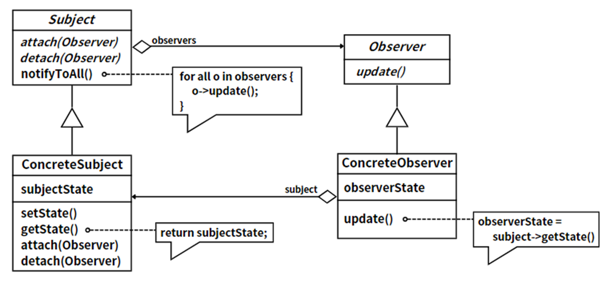 |
| [迭代器 (Iterator)](./behavioral/iterator) | 提供一种方法顺序访问一个聚合对象中各个元素，而又不需暴露该对象的内部表示。 |  |
| [备忘录 (Memento)](./behavioral/memento) | 在不破坏封装性的前提下，捕获一个对象的内部状态，并在该对象之外保存这个状态。 |  |
| [状态 (State)](./behavioral/state) | 允许一个对象在其内部状态改变时改变它的行为。 | 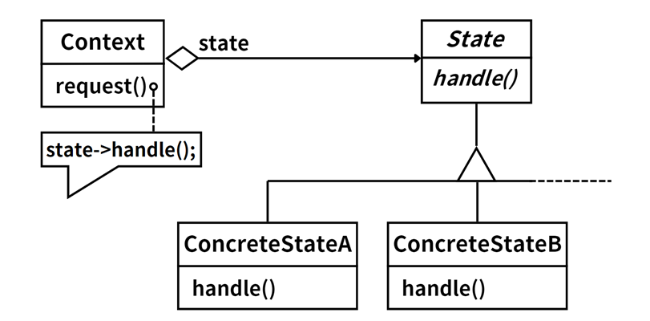 |
| [命令 (Command)](./behavioral/command) | 将一个请求封装为一个对象，从而使你可用不同的请求对客户进行参数化。 | 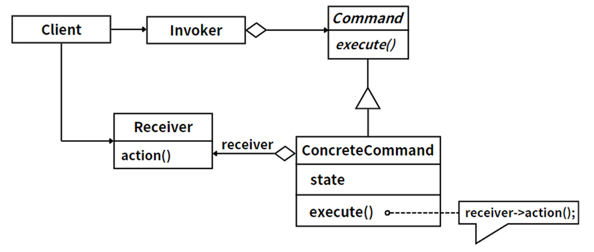 |
| [责任链 (Chain of Responsibility)](./behavioral/chain-of-responsibility) | 使多个对象都有机会处理请求，从而避免请求的发送者和接收者之间的耦合关系。 |  |
| [访问者 (Visitor)](./behavioral/visitor) | 表示一个作用于某对象结构中的各元素的操作。 | 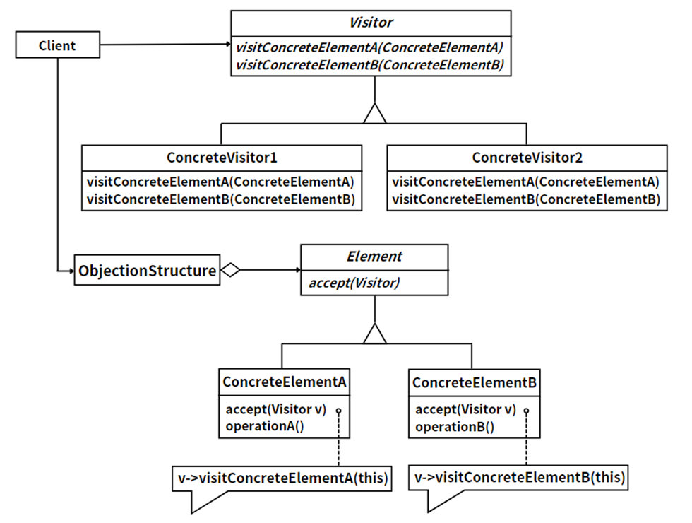 |
| [解释器 (Interpreter)](./behavioral/interpreter) | 定义一个语言的文法表示，并定义一个解释器，这个解释器使用该表示来解释语言中的句子。 | 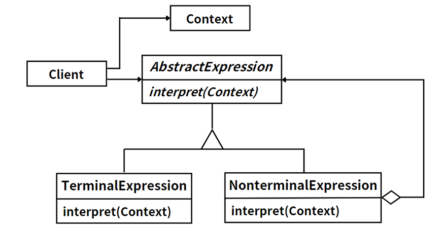 |

## 范围：类模式 vs. 对象模式

模式还可以按**范围**分类：

### 类模式

类模式关注**类与子类之间的静态关系**，使用继承和静态方法分享行为。关系在**编译时**确定。

-   **优点**：结构清晰，易于理解；通过继承实现代码复用。
-   **缺点**：深层的继承结构可能导致复杂性；继承是静态的，缺乏灵活性。

### 对象模式

对象模式关注**对象之间的动态关系**，使用接口、组合和委派。关系在**运行时**确定。

-   **优点**：更高的灵活性和扩展性；减少了对象间的耦合。
-   **缺点**：随着对象关系增多，可能会增加复杂性；动态组合可能会产生细微的性能影响。

## 为什么要学习设计模式？

-   **代码复用**：经过验证的方案减少了重复劳动，提高了开发效率。
-   **可维护性**：结构良好的代码更易于理解、修改和扩展。
-   **沟通成本**：模式为开发者讨论设计决策提供了共享的词汇表。
-   **灵活性**：基于模式的设计能更好地适应不断变化的需求。
-   **深入理解**：学习模式能加深你对面向对象原则的理解。

> 设计模式帮助开发人员从全新的角度审视代码 —— 构建更易于重用、扩展和维护的软件。
